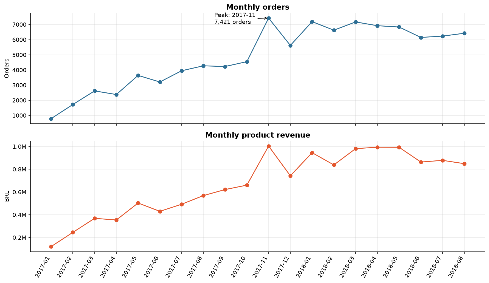
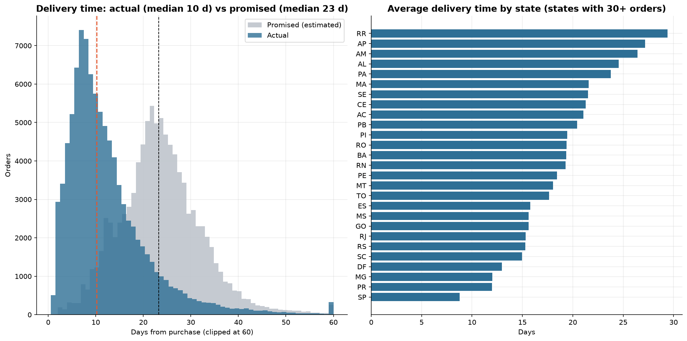
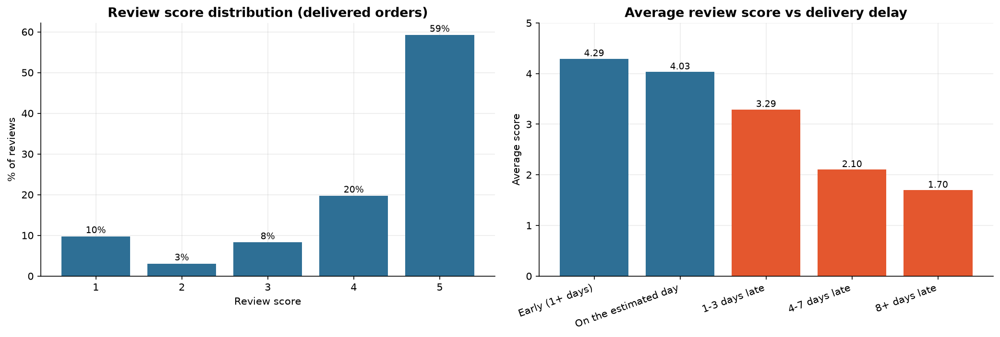
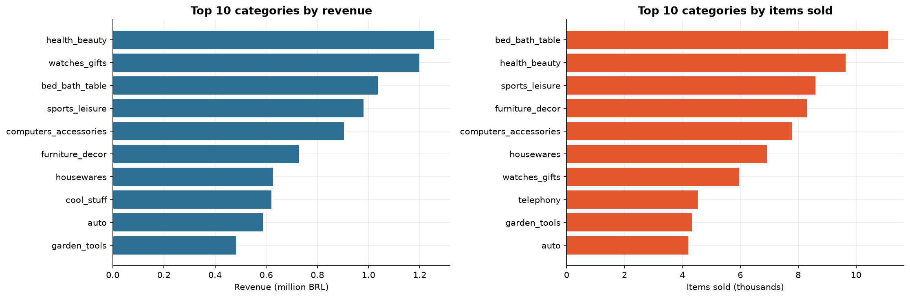

# Olist E-Commerce Analysis — Data Cleaning & EDA with Python

Exploratory analysis of ~100k real orders from a Brazilian marketplace (2016–2018): from raw relational CSV files to cleaned tables, KPIs, charts and business recommendations.

**Tools:** Python · Pandas · Matplotlib · Jupyter Notebook

> **Main takeaway:** late deliveries are rare (6.8% of orders) but costly. They average a review score of **2.27** vs **4.29** for on-time orders, and **97%** of customers never place a second order.

## Business questions
1. How did orders and revenue evolve over time, and when are the peaks?
2. Which product categories and customer states generate most of the revenue?
3. How do customers pay (payment type, instalments)?
4. How good is delivery performance — actual vs. promised delivery date?
5. Does late delivery hurt customer reviews?
6. How loyal are customers (repeat purchases)?

## Dataset
[Brazilian E-Commerce Public Dataset by Olist](https://www.kaggle.com/datasets/olistbr/brazilian-ecommerce) (Kaggle). Eight tables are used: orders, items, payments, reviews, customers, products, sellers and the category translation table. The ninth one, geolocation, is only checked for duplicates (it is not needed for the analysis).

The data is **not included** in this repository (see the license on the Kaggle page). Download it and put the CSV files in a `data/` folder.

### Headline KPIs

| Metric | Value |
|---|---|
| Orders analysed | 98,199 |
| Unique customers | 94,983 |
| Active sellers | 3,053 |
| Product revenue | BRL 13.49 M |
| Average / median order value | BRL 137.42 / 86.90 |
| Average review score | 4.12 / 5 |
| Delivered orders arriving on time | 93.2% |

*Canceled and unavailable orders (and orders without items) are excluded. Revenue means item prices only; freight (BRL 2.24 M) is not included.*

## What I did
1. **Inspected** the 8 tables: shapes, data types, relationships between tables, descriptive statistics.
2. **Checked data quality and cleaned:**

   | Issue found | Action |
   |---|---|
   | Date columns stored as text (8 columns) | Converted to `datetime` |
   | 551 orders with more than one review | Kept the latest review per order (99,224 → 98,673 rows) |
   | 2,965 missing delivery dates (only 8 on `delivered` orders) | Compared with `order_status`; kept (legitimate for undelivered orders), excluded anomalies from delivery analysis |
   | 610 products without category; Portuguese names | Filled with `unknown`; translated to English |
   | Misspelled column names (`lenght`) | Renamed |
   | Price outliers (7.5% of items above 277.40 BRL) | Kept (real products); used medians and clipped plots |
   | Incomplete months (2016, Sept–Oct 2018: 349 orders) | Excluded from trend analysis |
   | 1,234 canceled / unavailable orders | Excluded from revenue analysis |
   | 261,831 exact duplicate rows in `geolocation` (26.2%) | Dropped (optional table, not used in the analysis) |

3. **Joined the tables safely:** aggregated items and payments to one row per order *before* merging and added an `assert` to prove no order was duplicated.
4. **Explored the data (EDA)** and built 12 Matplotlib charts: trends, seasonality, categories, geography, payments, price distribution, delivery performance, reviews, loyalty and correlations.
5. **Summarised** the findings and recommendations.

## Key findings
All numbers are computed in the notebook (section 6).

- **Growth:** orders in Jan–Aug 2018 were **137%** higher than in Jan–Aug 2017 (revenue **+138%**), but monthly orders have been flat at roughly 6–7k since January 2018. The busiest day was **2017-11-24** with **1,166** orders vs. a daily average of 160.
- **Concentration:** the top 5 categories generate **40%** of revenue and the top 3 states (SP, RJ, MG) **63%**; São Paulo alone accounts for **38%**.
- **Payments:** **77%** of orders are paid by credit card and **52%** in 2+ instalments.
- **Delivery:** the median delivery takes **10.2** days vs **23.2** days promised; **6.8%** of orders arrive late (by a median of 7 days).
- **Geography:** delivery takes **29** days in RR vs **9** days in SP.
- **Satisfaction:** the average review score is **4.29** for on-time orders vs **2.27** for late orders; **54%** of late orders get a 1-star review vs **7%** of on-time ones.
- **Loyalty:** only **3.0%** of customers order more than once.

## Charts


*Orders peaked in November 2017 and have been flat since early 2018.*


*Orders arrive in 10 days (median) against 23 days promised, but the slowest state (RR) waits more than three times longer than SP.*


*The average review score falls from 4.29 for early deliveries to 1.70 for orders 8+ days late.*


*Revenue is spread across many categories: the largest one (health_beauty) is only 9.3% of the total.*

## Recommendations
1. **Attack the late tail, not the median.** Delivery is already fast on average, but the 6.8% of orders that arrive late get a 1-star review 54% of the time. Flag orders at risk of missing their date, warn customers proactively and prioritise the slowest states (RR 29 days, BA 19 days).
2. **Invest in retention.** Only 3.0% of customers order again, so growth depends almost entirely on new customers. A follow-up e-mail, voucher or loyalty programme after the first delivered order is a simple place to start.
3. **Prepare for peak days.** 2017 brought 1,166 orders in a single day. Plan stock, seller response times and carrier capacity ahead of November.
4. **Reduce the dependence on a few states, but fix logistics first.** SP, RJ and MG generate 63% of revenue. The other states are the growth opportunity, but they also wait longer for their orders, so marketing there should go together with logistics improvements. Category concentration is a smaller risk (the top category is 9.3% of revenue).

## How to run
```bash
python3 -m venv .venv && source .venv/bin/activate   # Windows: .venv\Scripts\activate
pip install -r requirements.txt
# put the Kaggle CSV files in ./data
jupyter notebook olist_ecommerce_analysis.ipynb
```
Tested with Python 3.13, pandas 3.0 and matplotlib 3.11. *Kernel → Restart & Run All* regenerates every output and saves the 12 charts in `images/`.

## Project structure
```
.
├── olist_ecommerce_analysis.ipynb   # full analysis (code + outputs + charts)
├── images/                          # charts saved by the notebook
├── data/                            # CSV files from Kaggle (not tracked by git)
├── requirements.txt
└── README.md
```

## Limitations and next steps
- No cost or margin data: "revenue" means item prices, not profit.
- The +137% growth compares against the platform's early ramp-up in 2017, so it overstates the recent trend.
- Reviews are optional, so the sample can be biased.
- Correlation is not causation: late deliveries go with lower scores, but other factors may play a role.
- Next: do late first orders reduce repeat purchases? How much of the regional delivery gap is explained by seller–customer distance? Then RFM customer segmentation, text analysis of review comments, a model to predict late deliveries and an interactive dashboard.

## Author
**Abdulrahman Atef Alfeqy** · [LinkedIn](https://www.linkedin.com/in/abdulrahman-atef-424710337)
